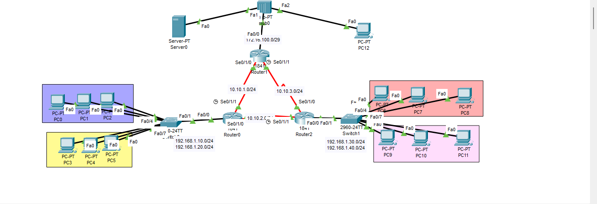

# Lab 04 – OSPF Single Area

## 🎯 Objectives
- Konfigurasi routing dinamis menggunakan OSPF single area  
- Integrasi antar router menggunakan serial link  
- Inter-VLAN routing dengan Router-on-a-Stick  
- DHCP Server pada router untuk distribusi IP otomatis ke setiap VLAN  
- Verifikasi komunikasi lintas VLAN dan lintas router  

---

## 🏗️ Topology
- 3 Router 2811 (R-1, R-2, R-3)  
- 2 Switch 2960 (SW-1, SW-2)  
- 1 Server (Email Service)  
- Beberapa PC (IT, HRD, Finance, Trader)  

---

## 📌 VLAN Plan
| VLAN | Department | Subnet          | Gateway       | DHCP Range            |
|------|------------|-----------------|---------------|-----------------------|
| 10   | IT         | 192.168.10.0/24 | 192.168.10.1  | 192.168.10.50–200     |
| 20   | HRD        | 192.168.20.0/24 | 192.168.20.1  | 192.168.20.50–200     |
| 30   | Finance    | 192.168.30.0/24 | 192.168.30.1  | 192.168.30.50–200     |
| 40   | Trader     | 192.168.40.0/24 | 192.168.40.1  | 192.168.40.50–200     |

---

## ⚙️ Configuration
- **Switch VLAN & trunk** → [config-switch.txt](config-switch.txt)  
- **Router sub-interfaces + OSPF + DHCP pools** → [config-router.txt](config-router.txt)  

---

## 🧪 Testing
1. PC di VLAN 10 dapat IP otomatis via DHCP ✅  
2. PC di VLAN 20 dapat IP otomatis via DHCP ✅  
3. PC di VLAN 30 & 40 dapat IP otomatis via DHCP ✅  
4. Test ping antar VLAN (IT ↔ HRD, Finance ↔ Trader) ✅  
5. Test ping antar router (R-1 ↔ R-2 ↔ R-3) via OSPF ✅  
6. Cek OSPF adjacency `show ip ospf neighbor` ✅  
7. Cek routing table `show ip route ospf` ✅  
