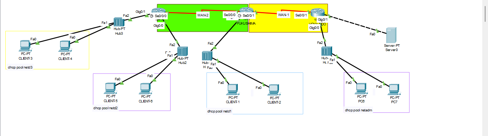

# OSPF Multi-Area Network Topology (Cisco Packet Tracer)

This project demonstrates the implementation of **OSPF Multi-Area Routing** using Cisco routers.  
The topology consists of one backbone area (Area 0) and one additional area (Area 1).  
Loopback interfaces are configured on each router to simulate router IDs.

## 

## IP Address List

### Routers

| Device   | Interface | IP Address    | Prefix | Notes        |
| -------- | --------- | ------------- | ------ | ------------ |
| Hokkaido | Lo0       | 1.1.1.1       | /32    | Router-ID    |
| Hokkaido | Se0/0/1   | 10.1xx.100.1  | /29    | To Fukushima |
| Hokkaido | G0/0      | 192.1xx.10.1  | /30    | LAN1         |
| Hokkaido | G0/1      | 192.1xx.20.14 | /28    | LAN2         |

| Device    | Interface | IP Address   | Prefix | Notes       |
| --------- | --------- | ------------ | ------ | ----------- |
| Fukushima | Lo0       | 2.2.2.2      | /32    | Router-ID   |
| Fukushima | Se0/0/1   | 10.1xx.100.2 | /29    | To Hokkaido |
| Fukushima | Se0/0/0   | 10.1xx.100.9 | /29    | To Tokyo    |
| Fukushima | G0/0      | 172.16.yy.30 | /27    | LAN3        |

| Device | Interface | IP Address    | Prefix | Notes        |
| ------ | --------- | ------------- | ------ | ------------ |
| Tokyo  | Lo0       | 3.3.3.3       | /32    | Router-ID    |
| Tokyo  | Se0/0/0   | 10.1xx.100.10 | /29    | To Fukushima |
| Tokyo  | G0/0      | 172.16.yy.33  | /27    | LAN4         |
| Tokyo  | G0/1      | 172.16.yy.65  | /27    | LAN5         |

---

### PCs

| Device        | IP Address   | Prefix | Gateway       |
| ------------- | ------------ | ------ | ------------- |
| FTP Server    | 192.1xx.10.2 | /30    | 192.1xx.10.1  |
| Admin (DHCP)  | DHCP Client  | /28    | 192.1xx.20.14 |
| Admin2 (DHCP) | DHCP Client  | /28    | 192.1xx.20.14 |
| Client1       | DHCP Client  | /27    | 172.16.yy.30  |
| Client2       | DHCP Client  | /27    | 172.16.yy.30  |
| Client3       | DHCP Client  | /27    | 172.16.yy.33  |
| Client4       | DHCP Client  | /27    | 172.16.yy.33  |
| Client5       | DHCP Client  | /27    | 172.16.yy.65  |
| Client6       | DHCP Client  | /27    | 172.16.yy.65  |
