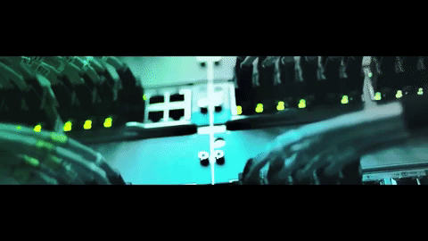

# 🖧 Networking Projects (Industrial Labs 2025)

Kumpulan **Cisco Packet Tracer Labs** untuk latihan konfigurasi jaringan — dari dasar hingga skenario **industry-ready 2025**.  
Setiap lab disusun **step-by-step** dengan dokumentasi, file `.pkt`, dan konfigurasi lengkap agar mudah dipelajari & direplikasi.  

---

  

---

## 📂 Daftar Lab

### ✅ Basic Labs
- **Lab 01 – Basic Config + DHCP**
  - IP Addressing & Subnetting
  - DHCP Server Configuration
  - Basic Router & Switch Setup
  - VLAN dasar (single switch)

- **Lab 02 – VLAN + Trunking + DHCP**
  - Multi-VLAN Setup
  - VLAN Trunking antar switch
  - DHCP untuk tiap VLAN
  - Troubleshooting dasar (ping test, inter-VLAN routing)

---

### 🚀 Industrial Labs
- **Lab 03 – Inter-VLAN Routing + DHCP Relay**
  - Router-on-a-Stick untuk inter-VLAN
  - Centralized DHCP Server
  - DHCP Relay (`ip helper-address`)
  - Segmentasi real-world (HR, Finance, IT, Guest)

- **Lab 04 – OSPF Single Area**
  - Dynamic routing antar router
  - Auto network discovery
  - Scalable design untuk enterprise

- **Lab 05 – OSPF Multi-Area**
  - Backbone area + area tambahan
  - Enterprise-ready design
  - Reduksi routing table (LSA filtering)

- **Lab 06 – ACL + VLAN Security**
  - Access Control List antar VLAN
  - Contoh: HR tidak bisa akses IT VLAN
  - VLAN security & traffic filtering

- **Lab 07 – Site-to-Site VPN (IPsec)**
  - Simulasi komunikasi aman antar kantor
  - Tunneling dengan IPsec
  - Data terenkripsi antar site

- **Lab 08 – Redundancy (HSRP/VRRP)**
  - High Availability (Gateway Redundancy)
  - Failover antar router
  - Enterprise reliability practice

---

## 🎯 Tujuan
- Dokumentasi hands-on lab untuk **pembelajaran & portofolio**  
- Menunjukkan skill dasar & intermediate **network engineer**  
- Menjadi resource terbuka bagi siapa pun yang belajar networking  

---

## 🔧 Tools
- **Cisco Packet Tracer** (simulasi topologi & konfigurasi)  
- **Git + GitHub** (version control & portofolio)  
- **Markdown** (dokumentasi project)  

---

## 🚀 Status
Progress (2025):  
- [x] Lab 01 – Basic Config + DHCP  
- [x] Lab 02 – VLAN + Trunking + DHCP  
- [x] Lab 03 – Inter-VLAN Routing + DHCP Relay  
- [x] Lab 04 – OSPF Single Area  
- [x] Lab 05 – OSPF Multi-Area  
- [ ] Lab 06 – ACL + VLAN Security  
- [ ] Lab 07 – Site-to-Site VPN (IPsec)  
- [ ] Lab 08 – Redundancy (HSRP/VRRP)  

---

✍️ Dibuat oleh: **Aji Pangestu**
